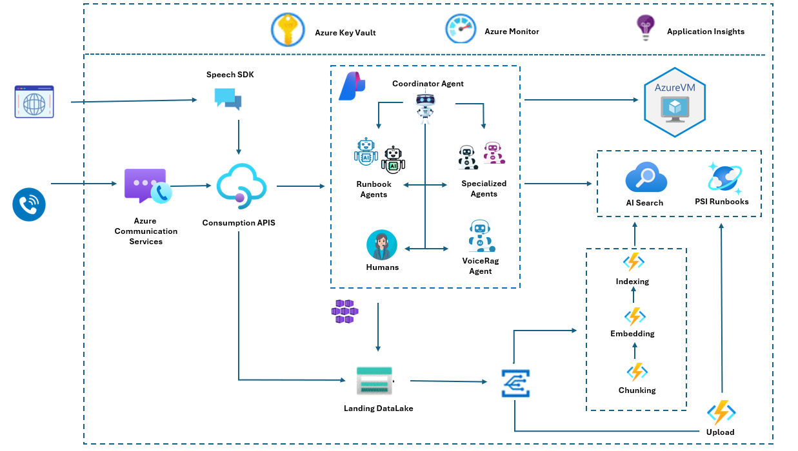

## 📌 Multi-Agent Automated Service Desk for Education

## INTERVIEW: https://www.youtube.com/watch?v=6nSfAGvXe2A

# 🎓 Multi-Agent Service Desk Automation

### Empowering universities with AI-driven support — fast, safe, and transparent

---

## 🚀 Overview

Large educational institutions struggle with repetitive service desk requests—password resets, course enrollment inquiries, transcript requests, and more. This leads to long wait times, frustrated students, and high operational costs.

Our solution introduces a **multi-agent automation platform** that intelligently resolves routine cases while escalating only the complex ones to human staff. It works across **web chat and voice**, ensuring accessibility for all users.

---

## 🤖 System Capabilities

✔ Multi-agent collaboration for accurate understanding and routing
✔ Retrieval-Augmented Generation (**RAG**) for trusted academic knowledge
✔ Automated execution through secure **Runbooks**
✔ Transparent decision-making and **graceful escalation** to humans
✔ Support for multiple service domains:

* **IT Support** (password resets, network issues, software access)
* **Student Services** (course planning, records, campus info)
* **Administrative Services** (special workflows, compliance)

---

## 🧠 Agent Architecture

### 🔹 Coordinator Agent

* Central brain of the platform
* Classifies intent, assigns the right agent, validates steps
* Ensures security, transparency, and approvals where needed

### 🔹 IT Support Agent

Handles:

* Account management & SSO issues
* License provisioning
* Device/software setup
* VPN & network troubleshooting

### 🔹 Student Services Agent

Handles:

* Course enrollment & scheduling
* Graduation requirements & academic support
* Campus services & facilities information
* Transcript / financial aid queries

### 🔹 Administrative Agent

Handles:

* Request routing & priority escalation
* Multi-step workflows
* Policy enforcement
* Edge cases requiring human review

### 🔹 VoiceRAG Agent

* Converts speech → text using Azure Speech SDK
* Leverages RAG to answer supported questions via phone calls

### 🔹 Runbook Agents

* Automate low-risk, verified tasks
* Integrations with internal systems
* Execution runs via **Azure VM + PSI Runbooks**

---

## 🏛️ Architecture Diagram

> The following represents our system running on Microsoft Azure

---

## 📚 RAG Knowledge System

✔ Institutional knowledge stored in Azure Data Lake
✔ Chunking → Embedding → Indexing pipeline
✔ Secure access via **Azure AI Search**
✔ Continuous updates from administrative uploads

Ensures answers remain **accurate, compliant, and explainable**.

---

## 🛡️ Governance & Safety

| Feature                                     | Benefit                                  |
| ------------------------------------------- | ---------------------------------------- |
| Approval gates                              | Prevent unauthorized automation          |
| Log & trace in App Insights + Azure Monitor | Full transparency & auditability         |
| Key Vault for secrets                       | Secure system-to-system credentials      |
| Human fallback system                       | Trust & reliability in complex scenarios |

---

## 🌐 Channels & UX

| Channel       | Technology                                     |
| ------------- | ---------------------------------------------- |
| Web chat      | Azure Communication Services                   |
| Phone support | ACS Voice + Speech SDK                         |
| API           | REST-based orchestration + automation triggers |

Users get the **same help** regardless of communication channel.

---

## 🛠️ Tech Stack

* Azure AI Studio / OpenAI models
* Azure Communication Services (ACS)
* Azure Key Vault
* Azure Monitor + Application Insights
* Azure Data Lake
* Azure AI Search
* Azure VM + PSI Runbooks
* Function Apps for Chunking + Embeddings

---

## 🧩 Example User Flow

1️⃣ User asks a question (web or phone)
2️⃣ Coordinator Agent classifies the request
3️⃣ RAG retrieves validated information
4️⃣ Specialized agent handles the domain task
5️⃣ If safe → Runbook executes automation
6️⃣ If not → escalated to university staff
7️⃣ User receives clear explanation every step of the way

---

## 🟣 Why This Matters

🎯 Reduces wait times dramatically
🎯 Trusted automations with full traceability
🎯 Focuses human staff on meaningful work
🎯 Improved accessibility for students and faculty

> This platform can scale across IT, HR, finance, facilities — anywhere repetitive support tasks exist.

---

## 👥 Team

Eleazar David Condori Huanquiri eledavid88@gmail.com

Eugenio Francisco Condori Rojas eufanzky@gmail.com

---

## 💡 Future Enhancements

* Personalization using secure student profile context
* Support for multilingual experience
* Integration with SIS/ERP systems (Banner, PeopleSoft, etc.)

